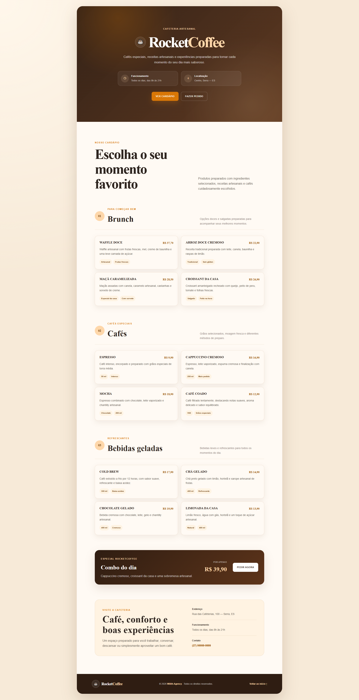

# ☕ RocketCoffee

Cardápio digital desenvolvido para uma cafeteria artesanal, com foco em design moderno, apresentação dos produtos, responsividade e boas práticas de desenvolvimento front-end.



O projeto foi criado inicialmente durante meus estudos de HTML e CSS e posteriormente refatorado, recebendo melhorias de estrutura, conteúdo, semântica, acessibilidade, responsividade, identidade visual e organização do código.

---

## 🌐 Demonstração

🔗 **Acesse o projeto:**

https://rocketcoffe-shippc.netlify.app/


---

## 🚀 Gostou deste projeto?

Este website foi desenvolvido por mim como parte do meu portfólio de desenvolvimento front-end.

Se você procura um site profissional, landing page, portfólio, website institucional, cardápio digital ou uma solução personalizada para o seu negócio, conheça meu trabalho na **Wilith Agency**.

🌐 **Portfólio Profissional**

https://wilithagency.netlify.app/

---

## ✨ Funcionalidades

- 🖥️ Página inicial com Hero
- ☕ Apresentação da identidade RocketCoffee
- 🕒 Informações de funcionamento
- 📍 Localização da cafeteria
- 📋 Cardápio digital organizado por categorias
- 🧇 Seção de brunch
- ☕ Seção de cafés especiais
- 🧊 Seção de bebidas geladas
- ⭐ Destaque para o combo do dia
- 🏷️ Tags com características dos produtos
- 💰 Preços formatados no padrão brasileiro
- 📞 Informações de contato
- 💬 Botão para pedidos pelo WhatsApp
- ⬆️ Link para voltar ao início
- 📱 Layout totalmente responsivo
- 🎯 Navegação suave entre seções
- ♿ Estrutura HTML semântica
- 🔍 SEO básico
- 🎨 Efeitos de hover e transições

> O botão de pedido utiliza um número demonstrativo e deve ser atualizado com o WhatsApp real da cafeteria.

---

## 🚀 Tecnologias

- HTML5
- CSS3
- Google Fonts

---

## 📱 Responsividade

O projeto foi desenvolvido para oferecer uma excelente experiência em diferentes dispositivos.

- 💻 Desktop
- 💼 Notebook
- 📱 Tablet
- 📲 Smartphone

---

## 📂 Estrutura

```text
RocketCoffee/
│
├── css/
│   └── style.css
│
├── images/
│   └── preview.png
│
├── index.html
└── README.md
```

---

## 🎯 Objetivos do Projeto

Este projeto teve como objetivo praticar e aprimorar conhecimentos em desenvolvimento front-end, incluindo:

- HTML semântico
- CSS moderno
- Flexbox
- CSS Grid
- Responsividade
- Organização de código
- Variáveis CSS
- Componentes reutilizáveis
- Hierarquia visual
- Tipografia responsiva
- Cards de produtos
- Botões e estados de interação
- Acessibilidade
- SEO
- Estruturação de cardápios digitais
- Refatoração de projetos antigos

---

## 👨‍💻 Autor

### Wilhan Mac'Arthur

Desenvolvedor Front-end e fundador da **Wilith Agency**, especializado na criação de websites modernos, landing pages, portfólios profissionais e soluções para empresas.

### 🌐 Links

- **Portfólio:** https://wilithagency.netlify.app/
- **GitHub:** https://github.com/shippc
- **LinkedIn:** https://www.linkedin.com/in/wilhanmacarthur/

---

⭐ Se este projeto foi útil ou serviu de inspiração, considere deixar uma estrela no repositório.